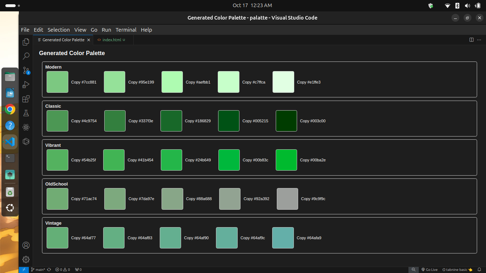
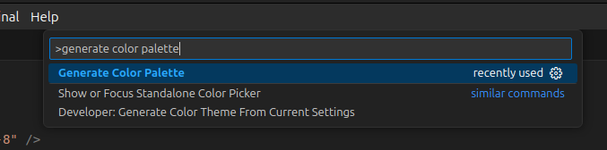
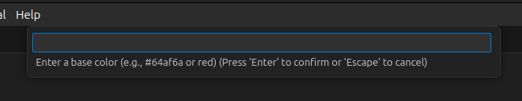
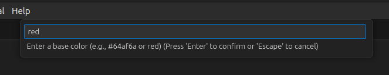
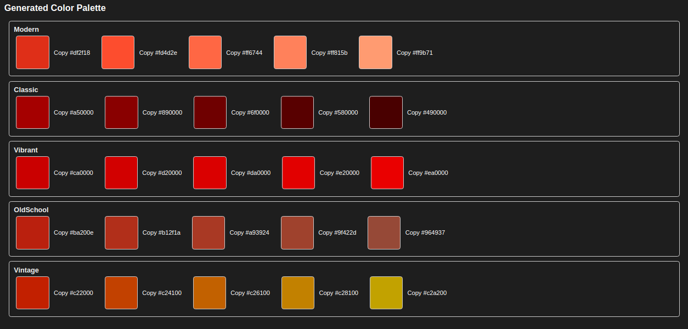

# 🎨 Color Palettes Generator

## Overview

A **Visual Studio Code** extension that generates color palettes based on a user-defined base color. The extension allows you to input a color name or hex code and provides 5 shades for each category: Modern, Classic, Vibrant, Old School, and Vintage.

## Features

- **Input Colors:** Accepts color names (e.g., "red") or hex codes (e.g., `#64af6a`).
- **Generate Palettes:** Creates a palette of 5 shades for various categories:
  - **Modern:** Brightened shades for a fresh look.
  - **Classic:** Darkened shades for a timeless appeal.
  - **Vibrant:** Saturated shades for bold designs.
  - **Old School:** Desaturated shades for a vintage touch.
  - **Vintage:** Hue-adjusted shades for a retro vibe.
- **Easy Copying:** Copy color values to the clipboard with a single click.
- **Intuitive UI:** User-friendly interface for a seamless experience.

---

## Installation

1. Open **Visual Studio Code**.
2. Go to the **Extensions** view by clicking on the Extensions icon in the Activity Bar or pressing `Ctrl+Shift+X`.
3. Search for **Color Palette Generator**.
4. Click **Install**.

---

## Usage

1. Open the **Command Palette** (`Ctrl+Shift+P`).
2. Type **`Generate Color Palette`** and select the command.
3. Enter a base color (either by name or hex code) in the input box.
4. A new panel will appear, showcasing the generated color palette.
5. Click the **Copy** button next to any color to copy it to the clipboard.

---

## Example

- **Input:** `#64af6a`
- **Output:**
  - **Modern:**  `#8bd5a0`
  - **Classic:**  `#337f3e`
  - **Vibrant:**  `#00ba2e`
  - **Old School:**  `#3f7d3c`
  - **Vintage:**  `#64af77`

---

## Screenshots

<!--  -->

- **step 1 :**
  
- **step 2 :**
  
- **step 3 :**
  
- **step 4 :**
  

---

## Video Tutorial

## Contributions

Contributions are welcome! Feel free to submit issues or pull requests. Check out our [Contributing Guide](CONTRIBUTING.md) for more details.

---

## License

This project is licensed under the MIT License. See the [LICENSE](LICENSE) file for details.

---

## Acknowledgements

- [Chroma.js](https://gka.github.io/chroma.js/) for color manipulation.
- Special thanks to all contributors and users for their feedback!

---

## Stay Connected

- **GitHub:** [see me on GitHub](https://github.com/shoto87)
- **Twitter:** [for contact ](https://x.com/shoto87665)

---
